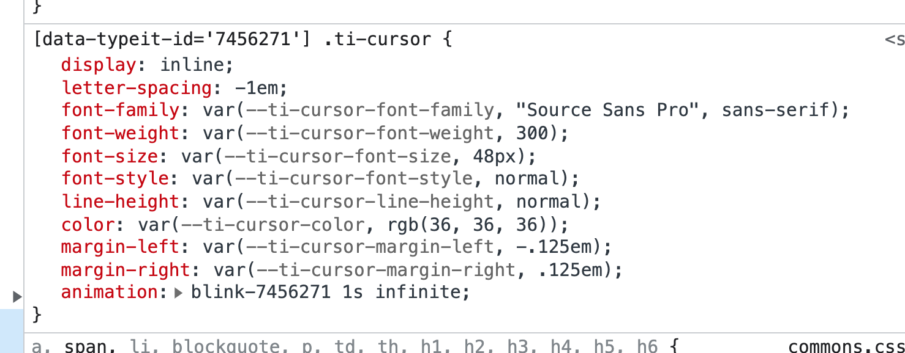

## Cursor Styling

When an animation is initialized, the cursor is dynamically styled based on the font properties in which it lives. These values are set with CSS custom properties, which fall back to those dynamically-calculated values. For example, when you inspect an animation, you'll see something like this:



You're welcome to customize these values as needed by setting the value for a property in your CSS. For example:

```css
:root {
  --ti-cursor-color: dodgerblue;
}
```

### Custom Properties

Here are all of the custom properties defined for styling the cursor, along with the default values.

| Property                | Default Value                  |
| ----------------------- | ------------------------------ |
| --ti-cursor-font-family | computed from inherited styles |
| --ti-cursor-font-weight | computed from inherited styles |
| --ti-cursor-font-size   | computed from inherited styles |
| --ti-cursor-font-style  | computed from inherited styles |
| --ti-cursor-line-height | computed from inherited styles |
| --ti-cursor-color       | computed from inherited styles |
| --ti-cursor-transform   | translateX(-.125em)            |

### Special Note About Cursor Positioning

Note the default `transform` value above. This property is used to control the cursor's positioning next to a given character, and it's rather difficult to reliably calculate a computed value based on inherited styles. The value that's set should be fine for just about every animation. But, if you find yourself wanting to move the cursor closer or farther from a character, that's the one to tweak.

## Customizing the Cursor Animation

TypeIt's cursor animation relies on the [Web Animation API](https://developer.mozilla.org/en-US/docs/Web/API/Web_Animations_API), and permits you to customize the underlying animation.

Setting the value to `false` will disable the animation altogther. Setting `true` (default) will use a standard blinking animation. In order to customize this animation, you may do so by passing an object with an `animation` property:

```js
new TypeIt("#element", {
    strings: ["hi!"],
    cursor: {
        animation: {
            frames: [
                ...your frames here.
            ]
            options: {
                iterations: Infinity,
                easing: "linear",
                fill: "forwards",
            },
        },
    }
}
```

For a simple example, see [this demo](https://www.typeitjs.com/demos/customize-cursor-animation).
