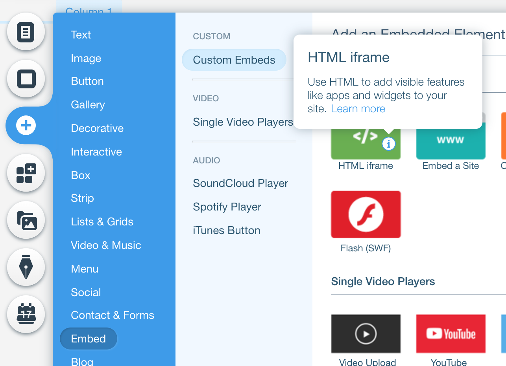
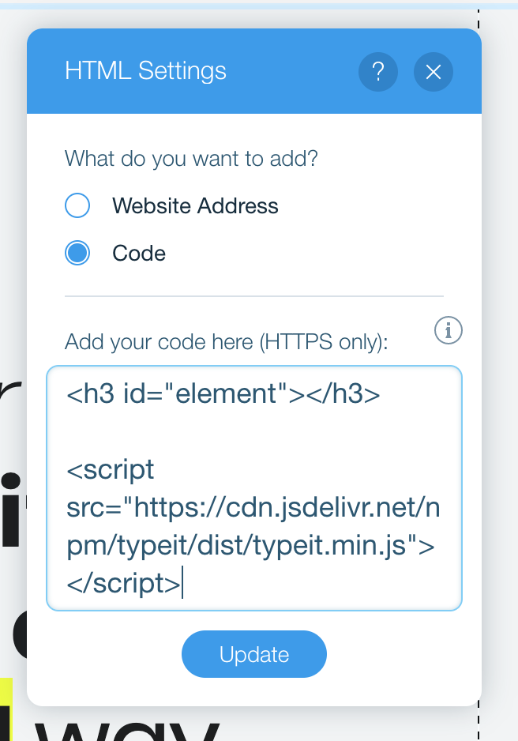

# Overview

TypeIt is the most versatile JavaScript tool for creating typewriter effects on the planet. With a straightforward configuration, it allows you to type single or multiple strings that break lines, delete & replace each other, and it even handles strings that contain complex HTML.

For more advanced typing effects, instance methods are available that can be chained to control your typing down to a single character, enabling you to create a dynamic, life-like narrative, with complete reign over speed changes, deletions, and even cursor position.

# Get a License

Using TypeIt for an open source or personal project is completely free. To use it in any commercial project, however, a license is required.

- **[Personal or Open Source](https://github.com/alexmacarthur/typeit)** - Just take it! It's free to use, as long as the project remains personal or open source.
- **[Limited Commercial License](/checkout/limited)** - Use TypeIt for a single commercial project of any sort.
- **[Unlimited Commercial License](/checkout/unlimited)** - Use TypeIt for an unlimited number of commercial projects, for as long as you're sucking air on Earth.

# Installation

**1\. Get the code through one of the following means:**

- [CDN](https://www.jsdelivr.com/package/npm/typeit) - Include the source on your page. Be sure to specify a version number.

  ```html
  <script src="https://cdn.jsdelivr.net/npm/typeit@%typeItVersion%/dist/typeit.min.js"></script>
  ```

- [npm / yarn](https://www.npmjs.com/package/typeit) - Install with `npm install typeit` or `yarn add typeit`.

- [Clone the Repo](https://github.com/alexmacarthur/typeit) - The compiled source files will be in the `/dist` directory.

**2\. Load the script on your page.**

Depending on your setup, you'll load TypeIt with a `script` tag , or an `import`, which will require the use of some sort of bundler, obviously.

```html
<script src="typeit.min.js"></script>
```

```javascript
import TypeIt from "typeit";
```

Whatever the case, just be sure you load and instantiate TypeIt _after_ the script and your target element are loaded on the page.

**3\. Create a Target Element**

You'll be able to designate a target element by tag name, class, ID, or anything else. For example, you might want to target elements with a .`type-effect` class attached to it.

```html
<span class="type-effect"></span>
```

If you want a fallback for users without JavaScript, you can put a string or strings right into this element. For more on that, see the [Defining Strings](#defining-strings) section. This will also be helpful if you're concerned about SEO.

# Quick-Start Template

If you're looking for a super simple template for how TypeIt should be loaded on an HTML page, here you go:

```html
<html>
  <head></head>
  <body>
    <!-- A root element for TypeIt to target. -->
    <span id="myElement"></span>

    <!-- The script itself, loaded AFTER your root element. -->
    <script src="https://cdn.jsdelivr.net/npm/typeit@%typeItVersion%/dist/typeit.min.js"></script>
    <script>
      new TypeIt('#myElement', {
        strings: "This is what will be typed!"
      }).go();
    </script>
  </body>
</html>
```

# Usage

## Basic Configuration

A fresh instance of TypeIt accepts two arguments:

- **element**: The element where text will be typed. This can be a DOM node or an element selector (class, ID, etc.). For example, all of the examples below are valid.

```javascript
new TypeIt('#myID', {...});
new TypeIt('.my-class', {...});
new TypeIt(document.querySelector('h2'), {...});
new TypeIt('[data-attribute="typeable"]', {...});
```

Note: If a selector that applies to several elements on the page (like a class), the _first_ element found will be targeted. Targeting multiple elements at once is not supported.

- **options**: An object that determines how the instance will behave. This is often where you'll define what strings will be typed, by passing them into the `strings` option:

```javascript
new TypeIt("#myElement", {
  strings: "This will be typed!"
}).go();
```

## Initialization

Declaring a new instance of TypeIt only gives you an inert instance with a ready-to-go queue of steps to type. To make your newly created instance actually go, use the `go()` method.

```javascript
new TypeIt("#myElement", {
  strings: "This will be typed!"
}).go(); // <!-- This will make it `go`.

// Or!

let myTypeItInstance = new TypeIt("#myElement", {
  strings: "This will be typed!"
});

myTypeItInstance.go();
```

## Defining Strings

You can define strings to be typed in a variety of ways.

- **Option #1**: Define them in your options as a string **_or_** an array of strings.

```javascript
new TypeIt("#myElement", {
  strings: "This will be typed!"
}).go();

// Or!

new TypeIt("#myElement", {
  strings: ["This will be typed!", "And this will be typed too."]
}).go();
```

- **Option #2**: Hard-code them in your target element.

This is a good option for those looking to optimize SEO. Include your string in your target element, and you're good to go.

```html
<span id="myElement">This string will be typed on page load.</span>
```

It's also possible to define _multiple_ strings by separating them with a `<br>` tag.

```html
<span id="myElement">My first string.<br />And my second string!</span>
```

Note: This approach may cause a flash of text before the instance is started. This is because the text will already be rendered on the page before TypeIt has a chance to parse it for the animation.

- **Option #3**: Define them with instance methods.

To define your strings more manually, use the `type()` instance method, and customize the effect even further by combining these with the other methods, described more below.

```javascript
new TypeIt("#myElement")
  .type("This is my first string!")
  .pause(1000)
  .type("Plus a little more.")
  .go();
```

### Typing in Form Elements

TypeIt supports typing into form elements like text inputs and textareas. However, due to the nature of these elements, some functionality maybe limited, like the use of a blinking cursor.

# Instance Methods

TypeIt includes a handful of chainable and non-chainable instance methods you can use to reign full, detailed control over an instance you create.

## Chainable Instance Methods

These methods must be used _before_ the `.go()` method is called on your instance. For example:

```javascript
// This will work!
new TypeIt("#element", {
  speed: 50
})
  .type("Helo!")
  .pause(500)
  .move(-2)
  .type("l")
  .go();

// This will NOT work!
const instance = new TypeIt("#element", {
  speed: 50
})
  .type("Helo!")
  .go();

instance.pause(500).move(-2).type("l");
```

### Method Descriptions

Method                                    | Description + Example
----------------------------------------- | ---------------------------------------------------------------------------------------------------------------------------------------------------------------------------------------------------------------------------------------------------------------------------------------------------------------------------------------------------------------------------------------------------------------------------------------------------------------------------------
`.type(string [, options])` | Type the string that's passed. As the second parameter, you can pass an options object that will only effect this particular step in the queue. For example, if you want to change the speed of typing only for this string, specify this like below:<br><br> `instance.type("My string!", {speed: 300})...go();` |
`.delete(numberOfCharacters [, options])` | Delete the number characters passed. If left empty (or `null`), everything that's typed will be deleted. As the second parameter, you can pass an options object that will only effect this particular step in the queue. For example, if you want to change the speed of deletion only for this string, specify this like below:<br><br> `instance.delete(5)...go();` |
`.pause(milliseconds [, options])`        | Pause the number (in milliseconds) passed. If left blank, the `nextStringDelay` value will be used.<br><br>`instance.pause(400)...go();` |
`.break(options)`                         | Insert a `<br>` tag.<br><br> `instance.break()...go();` |
`.options(opts [, otherOptions])`         | Update options on the fly. This will only impact options that are actively used during queue execution, which currently includes `speed`, `lifeLike`, and `html`.<br><br> `instance.options({speed: 500, lifeLike: false})...go();` |
`.empty()`                                | Instantly wipe out the contents of the target element.<br><br>`instance.empty()...go();` |                                                                                                                                                     
`.move(numberOfSteps [, options])`        | Move the cursor backward or forward the given number of characters. Passing "START" will cause the cursor to move to the beginning of what's been typed, and "END" will cause it to move to the end. As the second parameter, you can pass an options object that will only effect this particular step in the queue. For example, if you want to change the speed of cursor movement for this string, specify this like below:<br><br>`instance.move(-5, {speed: 55})...go();` |
`.exec(func [, options])`                 | Fire any arbitrary function wherever this is placed in the queue. This method is asyncronous, so you may configure it to completely pause the queue's execution until a returned Promise is made to resolve. See directly below for a terrible example.<br><br>`instance.exec(async () => await doSomethingAsync())...go();`

### Insert Delay After Instance Method

Instead of inserting `.pause()` after each action, you can set a `delay` after any given action is fired. For example:

```javascript
// This will work!
new TypeIt("#element", {
  speed: 50
})
  .type("Hello!", {delay: 2000})
  .delete(null, {delay: 1000})
  .type("Goodbye!")
  .go();
```

## Non-Chainable Instance Methods

The following methods are intended to be used _after_ an instance has been initialized and kicked off with `go()`:

### Destroying an Instance

Use the `.destroy()` method to cancel all timeouts attached to the instance, update the status of instance to `destroyed`, and, remove cursor from DOM. If `false` is passed, the cursor will not be removed.

```javascript
const instance = new TypeIt("#myElement", {
  strings: "This will be destroyed."
}).go();

instance.destroy();
```

### Resetting an Instance

Use the `.reset()` method to reset an active instance to a brand new state.

```javascript
const instance = new TypeIt("#myElement", {
  strings: "Some strings and stuff."
}).go();

instance.reset();
```

### Pausing & Resuming

Use the `.freeze()` and `.unfreeze()` methods on a active instance to pause its execution any time.

```javascript
new TypeIt("#myElement", {
  strings: "After 500ms, pause for 3 seconds and resume."
}).go();

setTimeout(() => {
  instance.freeze();

  setTimeout(() => {
    instance.unfreeze();
  }, 3000);
}, 500);
```

### Checking State

Use TypeIt's `.is()` method to check the current status of an instance at any time. Available statuses to check include `started`, `complete`, `frozen`, and `destroyed`. A boolean will always be returned.

```javascript
let instance = new TypeIt('#myElement', {...});

instance.is('started');
instance.is('completed');
instance.is('frozen');
instance.is('destroyed');
```

# Callback Methods

Included in the options are five callback methods available for use at certain times during the execution of a queue.

- `step` : The relevant step in the queue being handled when each callback fires.
- `instance` : This is the `TypeIt` instance itself, should you need it.

```javascript
new TypeIt("#element", {

  beforeStep: async (step, instance) => {
    // Will fire before each step in the queue.
  },

  beforeString: async (step, instance) => {
    // Will fire before each string in the queue.
  },

  afterStep: async (step, instance) => {
    // Will fire after each step in the queue.
  },

  afterString: async (step, instance) => {
    // Will fire after each string in the queue,
    // including those added by the `.type()` instance method.
  },

  afterComplete: async (step, instance) => {
    // Will fire after the entire instance has completed typing.
    // NOTE: If "loop" is enabled, this will never fire.
  }
});
```

# Options

Set any options for an instance by passing them as the second argument in TypeIt's constructor:

```javascript
new TypeIt("#element", {
  // Options go here!
}).go();
```

**Name & Default Value**  | **Description**
------------------------- | ---------------------------------------------------------------------------------------------------------------------------------------------------------------------------------------------------------------------------------------------------------------
`strings: []`             | `[string \| array]` String(s) of text to be typed.
`speed: 100`              | `[number]` Typing speed, measured in milliseconds between each step.
`deleteSpeed: null`       | `[number \| null]` Deletion speed. If left null, will be 1/3 of the type speed.
`lifeLike: true`          | `[boolean]` Makes the typing pace irregular, as if a real person is doing it.
`cursor: true`            | `[boolean]` Show a blinking cursor at the end of the string(s).
`cursorSpeed: 1000`       | `[number]` The blinking speed of the cursor, measured in milliseconds.
`cursorChar: \|`           | `[string]` The character used for the cursor. HTML works too!
`breakLines: true`        | `[boolean]` Controls whether multiple strings are printed on top of each other (`breakLines: true`), or if they're deleted and replaced by each other (`breakLines: false`).
`nextStringDelay: 750`    | `[number \| array]` The amount of time (in milliseconds) between typing multiple strings. If an array is passed, the first value will be used as the delay before a new string starts, and the second value will be used as the delay after a string has just ended. For example, passing `[1000, 2000]` will tell TypeIt to pause for 1000ms before typing a new string, and wait for 2000ms after a string has just completed. If a number is passed, that value will be halved.
`waitUntilVisible: false` | `[boolean]` Determines if the instance will begin typing automatically on `.go()`, or only when the target element becomes visible in the viewport. If you don't want instances far down on the page to begin until they're visible, set this option to `true`.
`startDelete: false`      | `[boolean]` Whether to begin instance by deleting strings inside element, and then typing what strings are defined via JSON or companion functions. Obviously, if this is set to `true`, you should have strings defined hard-coded in your target element.
`startDelay: 250`         | `[number]` The amount of time before the plugin begins typing after being initialized.
`loop: false`             | `[boolean]` Whether your strings will continuously loop after completing.
`loopDelay: null`         | `[number \| array]`The amount of time between looping over a string or set of strings again. This option behaves identically to`nextStringDelay`. If an array is passed, the first value will be the time before typing begins again (after the set of strings has been deleted), and the second value will be the time immediately after the set of strings has finished typing, before they're deleted to restart. If left undefined, the`nextStringDelay` option will be used.
`html: true`              | `[boolean]` Controls whether strings are parsed as HTML, or handled literally. If your target element is a form input or textarea, this value will automatically be overridden to `false`.

# Browser Support

In the compiled source code, two types of bundles exist -- one for browsers that support ES2015+ (which accounts for a [very strong majority](https://caniuse.com/#feat=es6-class) of users), as well as for those that do not. If you're using IE11 or older, you'll also need the following polyfills:

- `Array.prototype.fill`
- `Array.prototype.find`
- `Array.from`
- `IntersectionObserver`
- `Math.sign`
- `Object.assign`
- `Promise`

You can load all of these yourself, or just use the following pre-made bundle from [Polyfill.io](https://polyfill.io):

```html
<script src="https://polyfill.io/v3/polyfill.min.js?features=Array.prototype.fill%2CIntersectionObserver%2CObject.assign%2CPromise%2CArray.from%2CArray.prototype.find%2CMath.sign"></script>
```

It should also go without saying that it's wise to test any implementation of TypeIt (or anything else) in your target browsers.

# Use in Website Builders

## Squarespace

To use TypeIt on a Squarespace, you'll need to find the features that allow you to inject custom HTML and JavaScript. Here are the high-level steps to do that:

**1\. Open up the page you want the effect to appear and add a new [code block](https://support.squarespace.com/hc/en-us/articles/205815928-Adding-custom-HTML-CSS-and-JavaScript#toc-adding-code).**

In that block, create an empty element that will serve as the anchor for TypeIt. For example:

```html
<h3 id="myElement"></h3>
```

**2\. Navigate to the Advanced Settings section to find where you can [inject code](https://support.squarespace.com/hc/en-us/articles/205815908-Using-Code-Injection) into the footer of every page.**

In that textarea, paste the following code that will load the TypeIt source script and initialize your instance.

Note: If you don't want to load the script on every page, you could also paste this snippet below the element you created in the first step.

```html
<script src="https://cdn.jsdelivr.net/npm/typeit@%typeItVersion%/dist/typeit.min.js"></script>
<script>
  document.addEventListener('DOMContentLoaded', function() {
    new TypeIt('#element', {
      strings: ['This is my string!']
    }).go();
  });
</script>
```

## Wix

Again, in order to use TypeIt with Wix, you'll need to locate where you can inject custom HTML and JavaScript into your site. Wix has a "Dev Mode" that allows you to get fairly involved, but a simpler approach will look like the following:

**1\. In the website editor, hover over the "plus" icon, select "Embed," and choose "HTML iframe."**



**2\. Click "Enter Code" above the box that appears, and paste the HTML, source `<script>` tag, and your initialization inside the textarea.**

<div style="margin: 0 auto 1rem; max-width: 300px;">
  
</div>

What you paste into that box must look something like this:

```html
<span id="myElement"></span>

<script src="https://cdn.jsdelivr.net/npm/typeit@%typeItVersion%/dist/typeit.min.js"></script>
<script>
  new TypeIt('#myElement', {
    strings: "This is what will be typed!"
  }).go();
</script>
```

For more information on this, dig into Wix's documentation on [adding custom code to your site.](https://support.wix.com/en/article/adding-code-to-your-site)

## WordPress

For use within a WordPress site, it's recommended that you leverage the [WordPress plugin for TypeIt](/docs/wordpress).

# Examples

I have a few CodePen examples that illustrate how to do some interesting things with TypeIt.

- [Cute Rainbow Effect Using a Callback Method](https://codepen.io/alexmacarthur/pen/jzybpB)
- [Chained Typing Animations](https://codepen.io/alexmacarthur/pen/MOPQvp)
- ['Fill in the Blank' Effect](https://codepen.io/alexmacarthur/pen/pdXLRG)
- [Movable Cursor](https://codepen.io/alexmacarthur/pen/rNVMXaV)
- [Remove Cursor After Completion](https://codepen.io/alexmacarthur/pen/WzVqeM)

# Need Help?

If you're working with a custom implementation of TypeIt and would like some help, I'm available for hire. [Get in touch!](https://macarthur.me/contact)

# License

[GPL-2.0](https://github.com/alexmacarthur/typeit/blob/master/LICENSE) © Alex MacArthur
